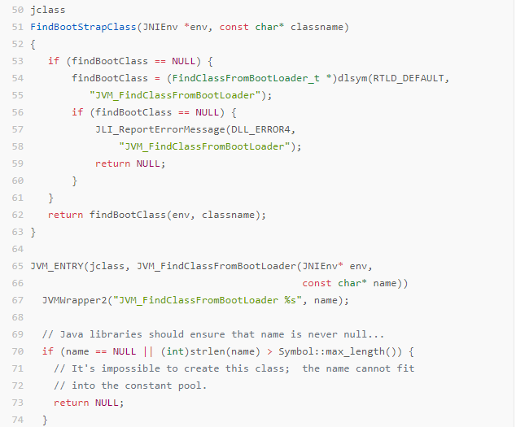

[toc]
<!-- D:\工作开发\VSCode\VSCode-workplace\MyAbilityUP\picture\JVM -->
#1.什么是JVM、体系结构是怎么样的？
JVM是Java Virtual Machine（Java虚拟机）的缩写，JVM是一种用于计算设备的规范，它是一个虚构出来的计算机，是通过在实际的计算机上仿真模拟各种计算机功能来实现的。Java虚拟机包括一套字节码指令集、一组寄存器、一个栈、一个垃圾回收堆和一个存储方法域。 JVM屏蔽了与具体操作系统平台相关的信息，使Java程序只需生成在Java虚拟机上运行的目标代码（字节码）,就可以在多种平台上不加修改地运行。JVM在执行字节码时，实际上最终还是把字节码解释成具体平台上的机器指令执行。
主要的子系统构成
•类加载子系统
•运行时数据区（内存结构）
•执行引擎

#2.JVM中类加载的过程是怎么样的？
Java的每个类，在JVM中，都有一个对应的Klass类实例与之对应，存储类的元信息如：常量池、属性信息、方法信息。
##一、klass模型类的继承结构：

从继承关系上也能看出来，类的元信息是存储在原空间的
普通的Java类在JVM中对应的是instanceKlass类的实例，再来说下它的三个字类InstanceMirrorKlass：用于表示

- java.lang.Class，Java代码中获取到的Class对象，实际上就是这个C++类的实例，存储在堆区，学名镜像类
- InstanceRefKlass：用于表示java/lang/ref/Reference类的子类InstanceClassLoaderKlass：用于遍历某个加载器加载的类
  
Java中的数组不是静态数据类型，是动态数据类型，即是运行期生成的，Java数组的元信息用ArrayKlass的子类来表示：

  - TypeArrayKlass：用于表示基本类型的数组
  - ObjArrayKlass：用于表示引用类型的数组
  

##二、类加载的过程

类加载机制：JVM把class文件加载到内存，并对数据进行校验、解析和初始化，最终形成JVM可以直接使用的java类型的全过程。
###加载过程
将.class文件通过IO流的方式加载到内存当中
1、通过类的全限定名获取存储该类的class文件（没有指明必须从哪获取）
2、解析成运行时数据，即instanceKlass实例，存放在方法区
3、在堆区生成该类的Class对象，即instanceMirrorKlass实例
###链接过程
1.验证阶段：文件格式验证、元数据验证、字节码验证、符号引用验证
2.准备阶段：给类中的静态变量分配内存，并赋予初始值
如果被final修饰，在编译的时候会给属性添加ConstantValue属性，准备阶段直接完成赋值，即没有赋初值这一步
###解析阶段
将虚拟机常量池的符号引用替换成字节引用的过程
将常量池中的符号引用转为直接引用
解析后的信息存储在ConstantPoolCache类实例中
1、类或接口的解析
2、字段解析
3、方法解析
4、接口方法解析
###初始化过程
初始化过程就会对类中的静态变量初始化为指定的值,执行静态代码块，执行构造器。静态字段、静态代码段，字节码层面会生成clinit方法方法中语句的先后顺序与代码的编写顺序相关。
###使用过程
###卸载过程
###总结
1.	将.class文件加载到内存在堆中会产生一个对应的Klass类的元信息作为方法区数据访问的入口
2.	链接过程将类中的静态变量分配内存，并且赋予初始值
3.	初始化对类中的静态变量初始化为指定的值,执行静态代码块，执行构造器。

#3.	JVM中类加载种类有哪些？
JVM中有两种类型的类加载器，由C++编写的及由Java编写的。除了启动类加载器（Bootstrap Class Loader）是由C++编写的，其他都是由Java编写的。由Java编写的类加载器都继承自类java.lang.ClassLoader。
##1.	启动类加载器Boostrap ClassLoader
负责加载JRE核心类库，jre包下rt.jar,charsets.jar等，C++语言编写，无法直接访问。因为启动类加载器是由C++编写的，通过Java程序去查看显示的是null，因此，启动类加载器无法被Java程序调用。启动类加载器不像其他类加载器有实体，它是没有实体的，JVM将C++处理类加载的一套逻辑定义为启动类加载器

##2.	扩展类加载器ExtClassLoader
负责加载JRE扩展目录ext中的jar包

##3. 应用类加载器AppClassLoader
负责加载classPath路径下的类包

##4. 自定义类记载器
负责加载用户自定义下的类包，实现自定义类加载器：extends ClassLoader，重写loadClass方法进行类的加载

##5.	 JVM中类加载的类如何存储？

##6.JVM中类加载机制哪些？
JVM的类加载机制主要有如下3种：

- **全盘负责：**所谓全盘负责，就是当一个类加载器负责加载某个Class时，该Class所依赖和引用其他Class也将由该类加载器负责载入，除非显示使用另外一个类加载器来载入。
  
- **双亲委派：**所谓的双亲委派，则是先让父类加载器试图加载该Class，只有在父类加载器无法加载该类时才尝试从自己的类路径中加载该类。通俗的讲，就是某个特定的类加载器在接到加载类的请求时，首先将加载任务委托给父加载器，依次递归，如果父加载器可以完成类加载任务，就成功返回；只有父加载器无法完成此加载任务时，才自己去加载。
双亲委派机制，其工作原理的是：如果一个类加载器收到了类加载请求，它并不会自己先去加载，而是把这个请求委托给父类的加载器去执行，如果父类加载器还存在其父类加载器，则进一步向上委托，依次递归，请求最终将到达顶层的启动类加载器，如果父类加载器可以完成类加载任务，就成功返回，倘若父类加载器无法完成此加载任务，子加载器才会尝试自己去加载，这就是双亲委派模式，即每个儿子都很懒，每次有活就丢给父亲去干，直到父亲说这件事我也干不了时，儿子自己才想办法去完成
双亲委派机制的优势：采用双亲委派模式的是好处是Java类随着它的类加载器一起具备了一种带有优先级的层次关系，通过这种层级关可以避免类的重复加载，当父亲已经加载了该类时，就没有必要子ClassLoader再加载一次。其次是考虑到安全因素，java核心api中定义类型不会被随意替换，假设通过网络传递一个名为java.lang.Integer的类，通过双亲委托模式传递到启动类加载器，而启动类加载器在核心Java API发现这个名字的类，发现该类已被加载，并不会重新加载网络传递的过来的java.lang.Integer，而直接返回已加载过的Integer.class，这样便可以防止核心API库被随意篡改 

- **缓存机制：**缓存机制将会保证所有加载过的Class都会被缓存，当程序中需要使用某个Class时，类加载器先从缓存区中搜寻该Class，只有当缓存区中不存在该Class对象时，系统才会读取该类对应的二进制数据，并将其转换成Class对象，存入缓冲区中。这就是为很么修改了Class后，必须重新启动JVM，程序所做的修改才会生效的原因。
  
- **双亲委派有啥好处呢？**
它使得类有了层次的划分。就拿java.lang.Object来说，你加载它经过一层层委托最终是由Bootstrap ClassLoader来加载的，也就是最终都是由Bootstrap ClassLoader去找<JAVA_HOME>\lib中rt.jar里面的java.lang.Object加载到JVM中。
这样如果有不法分子自己造了个java.lang.Object,里面嵌了不好的代码，如果我们是按照双亲委派模型来实现的话，最终加载到JVM中的只会是我们rt.jar里面的东西，也就是这些核心的基础类代码得到了保护。因为这个机制使得系统中只会出现一个java.lang.Object。不会乱套了。你想想如果我们JVM里面有两个Object,那岂不是天下大乱了。

**如何打破双亲委派？**
- 1：自己写一个类加载器
- 2：重写loadclass方法
- 3：重写findclass方法
  
这里最主要的是重写loadclass方法，因为双亲委派机制的实现都是通过这个方法实现的，先找附加在其进行加载，如果父加载器无法加载再由自己来进行加载，源码里会直接找到根加载器，重写了这个方法以后就能自己定义加载的方式了

#4.	JVM中PC寄存器、方法区、本地方法区、堆、栈的理解？
##1） 栈
- Java栈的区域很小，只有1M，特点是存取速度很快，所以在stack中存放的都是快速执行的任务，基本数据类型的数据，和对象的引用（reference）。
- 栈内存主管程序的运行，生命周期和线程同步，线程结束，栈内存释放。对于栈来说不存在垃圾回收。栈存放：8大借本类型(整型：byte, short, int, long 字符型：char  浮点型：float, double 布尔型：boolean)+对象引用+实例的方法
- JVM只会直接对JavaStack（Java栈）执行两种操作：①以帧为单位的压栈或出栈；②通过-Xss来设置，若不够会抛出StackOverflowError异常。
- 1.每个线程包含一个栈区，栈中只保存基本数据类型的数据和自定义对象的引用(不是对象)，对象都存放在堆区中
- 2.每个栈中的数据(原始类型和对象引用)都是私有的，其他栈不能访问。

- **栈帧**:JVM Stack（Stack 或虚拟机栈、线程栈、栈）中存放的就是栈帧、方法栈（栈帧包括了局部变量表+操作数栈+动态链接+返回地址）。
局部变量表：局部变量表（Local Variables Table）也可以称之为本地变量表，它包含在一个独立的栈帧中。顾名思义，局部变量表主要用于存储方法参数和定义在方法体内的局部变量
- **操作数栈**：每一个独立的栈帧中除了包含局部变量表以外，还包含一个后进先出（Last-In-First-Out）的操作数栈，也可以称之为表达式栈（Expression Stack）。操作数栈和局部变量表在访问方式上存在着较大差异，操作数栈并非采用访问索引的方式来进行数据访问的，而是通过标准的入栈和出栈操作来完成一次数据访问。每一个操作数栈都会拥有一个明确的栈深度用于存储数值，一个32bit的数值可以用一个单位的栈深度来存储，而2个单位的栈深度则可以保存一个64bit的数值，当然操作数栈所需的容量大小在编译期就可以被完全确定下来，并保存在方法的Code属性中。
- **动态链接**：每一个栈帧内部除了包含局部变量表和操作数栈之外，还包含一个指向运行时常量池中该栈帧所属方法的引用，包含这个引用的目的就是为了支持当前方法的代码能够实现动态链接（Dynamic Linking）。
在运行时常量池，一个有效的字节码文件中除了包含类的版本信息、字段、方法以及接口等描述信息外，还包含一项信息，那就是常量池表（Constant Pool Table），那么运行时常量池就是字节码文件中常量池表的运行时表示形式。在一个字节码文件中，描述一个方法调用了另外的其他方法时，就是通过常量池中指向方法的符号引用（Symbolic Reference）来表示的，那么动态链接的作用就是为了将这些符号引用转换为调用方法的直接引用。
- **返回地址**：一个方法在执行的过程中将会产生两种调用结果：一种是方法正常调用完成，而另外一种则是方法异常调用完成。如果是方法正常调用完成，那么这就意味着，被调用的当前方法在执行的过程中将不会有任何的异常被抛出，并且方法在执行的过程中一旦遇见字节码返回指令时，将会把方法的返回值返回给它的调用者，不过一个方法在正常调用完成之后究竟需要使用哪一个返回指令还需要根据方法返回值的实际数据类型而定。
在字节码指令中，返回指令包含ireturn（当返回值是boolean、byte、char、short和int类型时使用）、lreturn(从当前方法返回long)、freturn(从当前方法返回float)、dreturn(从当前方法返回double)以及areturn(从当前方法返回对象引用)，另外还有一个return指令供声明为void的方法、实例初始化方法、类和接口的初始化方法使用。

**JVM指令中ireturn作用**：
1.局部变量表指针恢复成Main方法的局部变量表指针 
2. 操作数栈方法的当前指针恢复成Main方法的操作数栈方法指针
3需要将运行时数据区中的程序计数器改成invokervirtual指令
4.将add方法中所占用的栈帧内存全部回收

##2） 堆
- 类的对象放在heap（堆）中，所有的类对象都是通过new方法创建，创建后，在stack（栈）会创建类对象的引用（内存地址）。
- JVM将所有对象的实例（即用new创建的对象）（对应于对象的引用（引用就是内存地址））的内存都分配在堆上，堆所占内存的大小由-Xmx指令和-Xms指令来调节。
- 加上JVM参数-verbose:gc -Xms10M -Xmx10M -XX:+PrintGCDetails -XX:SurvivorRatio=8 -XX:+HeapDumpOnOutOfMemoryError，就能很快报出OOM异常（内存溢出异常）：Exception in thread "main" java.lang.OutOfMemoryError: Java heap space并且能自动生成Dump

##3） 方法区
- method（方法区）又叫静态区，存放所有的①类（class），②静态变量（static变量），③静态方法，④常量和⑤成员方法。
- 方法区又叫静态区，跟堆一样，被所有的线程共享。方法区中存放的都是在整个程序中永远唯一的元素。这也是方法区被所有的线程共享的原因
- 虚拟机的体系结构：①Java栈，② 堆，③PC寄存器，④方法区，⑤本地方法栈，⑥运行常量池。而方法区保存的就是一个类的模板，堆是放类的实例（即对象）的。
- 方法区的大小由-XX:PermSize和-XX:MaxPermSize来调节，类太多有可能撑爆永久代。静态变量或常量也有可能撑爆方法区。
  

##4）PC寄存器
- PC寄存器（ PC register ）：每个线程启动的时候，都会创建一个PC（Program Counter，程序计数器）寄存器。
- PC寄存器里保存有当前正在执行的JVM指令的地址。 每一个线程都有它自己的PC寄存器，也是该线程启动时创建的。保存下一条将要执行的指令地址的寄存器是：PC寄存器。
- PC寄存器的内容总是指向下一条将被执行指令的地址，这里的地址可以是一个本地指针，也可以是在方法区中相对应于该方法起始指令的偏移量。

##5）本地方法栈区
- 保存native方法进入区域的地址
